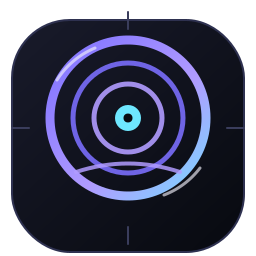
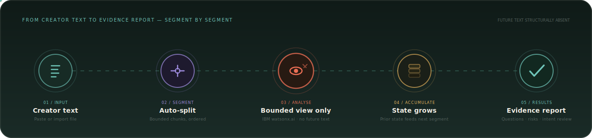
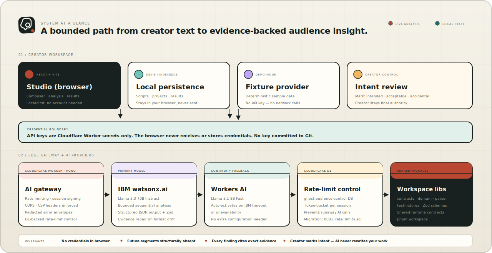

<p align="center">
  
</p>

<p align="center">
  
</p>

<h1 align="center">Ghost Audience</h1>

<p align="center">
  <strong>Meet your audience before you present, publish, or perform.</strong><br />
  Paste any substantial text, run one audience read, and receive evidence-backed questions,
  clarity risks, audience understanding, and likely real-world Q&amp;A — before you share.
</p>

<p align="center">
  
  
  
  
  
  
  
  
</p>

<p align="center">
  <a href="https://audience.grimnej.com"><strong>Open Ghost Audience</strong></a> ·
  <a href="#the-problem">The Problem</a> ·
  <a href="#how-it-works">How It Works</a> ·
  <a href="#system-architecture">Architecture</a> ·
  <a href="#features">Features</a> ·
  <a href="#development">Development</a>
</p>

---

## The problem

Creators know their entire story from the start. An audience experiences it one moment at a time.

That asymmetry makes accidental ambiguity, missing motivation, abandoned questions, and late explanations genuinely hard to notice. You cannot un-know your own ending.

Most AI review tools make this worse: they read your entire script before critiquing the opening. That gives the model hindsight and systematically hides first-time audience confusion.

## How it works

Ghost Audience processes your text **one segment at a time, with no access to future content**.

<p align="center">
  
</p>

For each segment `N`, the analysis request contains only:

- Accepted audience state accumulated through segment `N - 1`
- The current segment text
- Active unresolved audience questions
- A non-semantic analysis policy

Future segments and creator-supplied future intent are **structurally absent**. Every accepted finding must cite exact source evidence from the segment under review. The creator remains in control by marking each finding as intended, acceptable, accidental, or an incorrect AI interpretation.

### The prefix-independence guarantee

For two scripts with identical prefixes but different endings, Ghost Audience constructs byte-identical neutral analysis requests until the stories diverge. This is the core proof that future text is not leaking into earlier analysis steps.

## System architecture

<p align="center">
  
</p>

The browser never receives or stores API credentials. All keys live as Cloudflare Worker secrets and are never committed to Git. The Worker exposes a narrow set of endpoints behind session signing, CSRF enforcement, and rate limiting backed by Cloudflare D1.

Inside the Worker, IBM watsonx.ai is the primary analysis model. Cloudflare Workers AI activates automatically when IBM is unavailable or exceeds the interactive response window — with no user action required.

## Features

| Feature | What it does |
|---|---|
| **Audience Q&A** | Questions a real first-time audience would likely ask after reading your content |
| **Clarity risks** | Specific passages that may confuse, lose, or mislead the audience |
| **Reaction journey** | Segment-by-segment map of how audience emotion and understanding evolve |
| **Audience understanding** | What facts and context the audience has actually absorbed at each stage |
| **Exact evidence** | Every finding is pinned to a verbatim quote from your text — no vague claims |
| **Intent review** | Mark each finding as intended, acceptable, accidental, or an AI misread |
| **File import** | Import TXT, Markdown, or Fountain files in addition to paste |
| **Automatic continuity** | Workers AI silently takes over if IBM is slow or unavailable |
| **Fixture / demo mode** | Full UI with deterministic sample data — no API key or network call required |
| **Export** | Export your results from the Results workspace |
| **Local-first** | Projects and results stay in your browser via IndexedDB — no account needed |

## Product surfaces

Ghost Audience organizes the creator journey into focused workspaces:

| Surface | Purpose |
|---|---|
| **Composer** | Paste text or import a file, add an optional title and creator context, start analysis |
| **Analysis view** | Real-time progress as segments are processed one by one |
| **Results workspace** | Questions, clarity risks, reaction journey, understanding, evidence, and exports in one place |
| **Intent review panel** | Mark any finding to distinguish intended effects from accidental ones |
| **Projects screen** | Reopen any previously analyzed project from your browser's local storage |

## Using Ghost Audience

1. Open [audience.grimnej.com](https://audience.grimnej.com).
2. Click **Analyze your content**.
3. Paste your text, or import a `.txt`, `.md`, or `.fountain` file. A title and creator context are optional — neither can block analysis.
4. Click **Analyze my content**. The app auto-segments your text and processes each section in order.
5. Results open automatically when complete. Review Q&A, clarity risks, the reaction journey, audience understanding, and all evidence.
6. Use **Intent review** on any finding to mark it intended, acceptable, accidental, or an AI misread.
7. Return users can reopen saved projects from the **Projects** screen — no sign-in required.

## Why it matters

Human test readers remain essential, but they often arrive late and can be expensive or slow to coordinate. Ghost Audience provides an immediate pre-reader that exposes plausible questions without claiming to replace real audiences or creative judgment.

It works for speeches, stories, scripts, articles, pitches, essays, video narration, and any other written content you intend to share.

## Privacy

Scripts, projects, and accepted results are stored locally in the browser by default. Live analysis sends only the current segment and bounded prior state to the configured AI provider. Fixture mode sends nothing to any AI provider.

## Repository map

```text
apps/
  studio/              React + Vite creator workspace
    src/features/      analysis · intent · landing · project · results · script · timeline …
    worker/            Hono Cloudflare Worker gateway (AI proxy, rate limits, auth)
packages/
  contracts/           Shared Zod API + domain contracts
  domain/              Core domain logic
  parser/              Script segmentation and parsing
  test-fixtures/       Deterministic fixture data for demo mode and tests
migrations/            Cloudflare D1 SQL migrations
docs/
  assets/              SVG diagrams and visual assets
  DEPLOYMENT.md        Production deployment guide
  DEPLOYMENT_RECORD.md Verified production release record
  PROJECT_STATUS.md    Current project status
```

## Development

### Prerequisites

- Node.js `24.18.0`
- pnpm `11.14.0`
- Python `3.13` through `uv` for evaluation tools

### Install and validate

```bash
corepack enable
pnpm install --frozen-lockfile

pnpm lint
pnpm typecheck
pnpm test
pnpm build
```

### Run locally

```bash
# Apply local D1 migrations
pnpm --filter @ghost-audience/studio run db:migrate:local

# Start dev server (Vite + Worker via Wrangler)
pnpm --filter @ghost-audience/studio run dev
```

Copy `apps/studio/.dev.vars.example` to `apps/studio/.dev.vars` and fill in your `WATSONX_API_KEY` and `WATSONX_PROJECT_ID` for live analysis. Fixture mode works without any credentials.

### Run tests

```bash
# Unit and integration tests
pnpm --filter @ghost-audience/studio run test

# With coverage
pnpm --filter @ghost-audience/studio run test:coverage

# Browser / E2E tests (Playwright)
pnpm --filter @ghost-audience/studio run test:e2e
```

## AI and technical approach

| Layer | Technology |
|---|---|
| Primary analysis | IBM watsonx.ai · `meta-llama/llama-3-3-70b-instruct` |
| Automatic continuity | Cloudflare Workers AI · `@cf/meta/llama-3.1-8b-instruct-fast` |
| Creator workspace | React 19, TypeScript, Vite, React Router, TanStack Query |
| Edge gateway | Cloudflare Worker, Hono 4 |
| Rate limiting | Cloudflare D1 (`ghost-audience-control`) |
| Local persistence | Dexie 4 / IndexedDB |
| Runtime contracts | Zod 4 |
| Testing | Vitest, Playwright, axe-core |

## Delivery status

Ghost Audience is live at [audience.grimnej.com](https://audience.grimnej.com).

The rebuilt production release was verified on 2026-07-18. 72 TypeScript unit and integration tests and 16 browser tests across Chromium, Firefox, WebKit, and mobile Chromium passed. Studio test coverage reached 90.95 % statements, 80.21 % branches, and 94.17 % lines. GitHub Actions CI, Security, and Submission Gate workflows all passed for release commit `beda893`. A live end-to-end acceptance test using a 504-word narrative produced 6 questions, 4 clarity risks, and 2 clear audience signals with zero console errors.

See [`docs/DEPLOYMENT_RECORD.md`](docs/DEPLOYMENT_RECORD.md) for the complete verified release record, and [`docs/PROJECT_STATUS.md`](docs/PROJECT_STATUS.md) for the current project state.

## Limitations

- The system generates plausible, evidence-grounded audience questions; it does not represent all viewers.
- Model pretraining knowledge cannot be perfectly erased.
- The tool is not a box-office, quality, or virality predictor.
- It does not automatically rewrite your work.
- Human readers remain the final authority.

## Selected challenge theme

**July Challenge — Reimagine Creative Industries with AI**

Ghost Audience directly supports storytelling and content creation. It helps writers, filmmakers, video essayists, game-narrative designers, educators, and other creators understand how their work unfolds for a first-time audience before publication.
